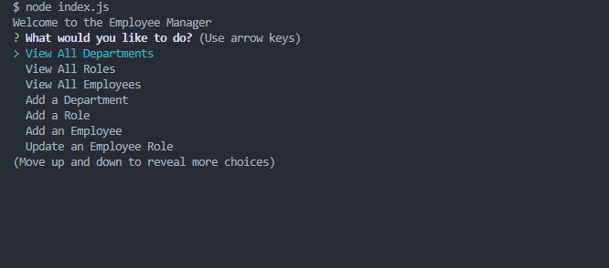
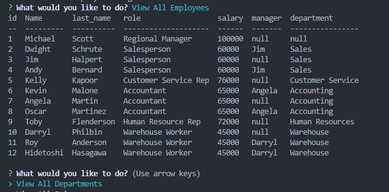

# Employee Tracker

This project is covered by the MIT license.
https://opensource.org/licenses/MIT;

## Description

An all in one place where you can keep track of your employees, the roles they fulfill, and the department they are a part of. You can add departments, roles, and employees, and update the roles of employees.

## Table of Contents

- [Description](#description)
- [Installation](#installation)
- [Usage](#usage)
- [License](#license)
- [Contributing](#contributing)
- [Tests](#tests)
- [Questions](#questions)

## Installation

Download the dependencies using npm i. Then run the program by calling node index.js. You will need to have mySQL installed and up to date. Navigate to the db folder and run the schema.sql file on mySQL.

## Usage

When you call the program an inquirer screen is opened.

You can complete any function using your keyboard and following the prompts.

## License

This project is covered by the MIT license.
https://opensource.org/licenses/MIT;

## Contributing

None

## Tests

None

## Questions

Contact [prkrgreenwell](https://github.com/prkrgreenwell) on GitHub with any questions you may have
